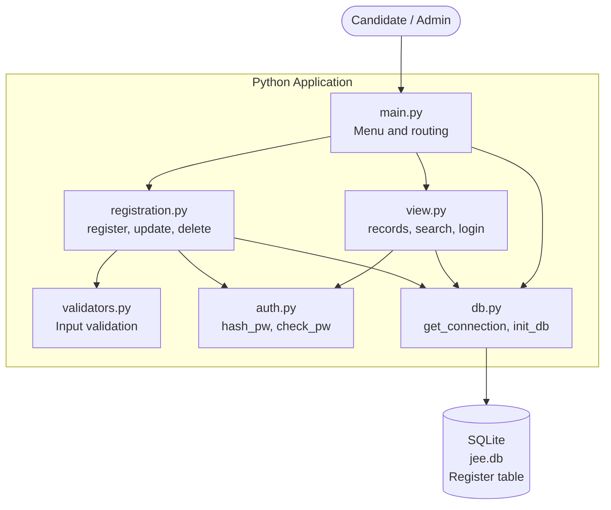
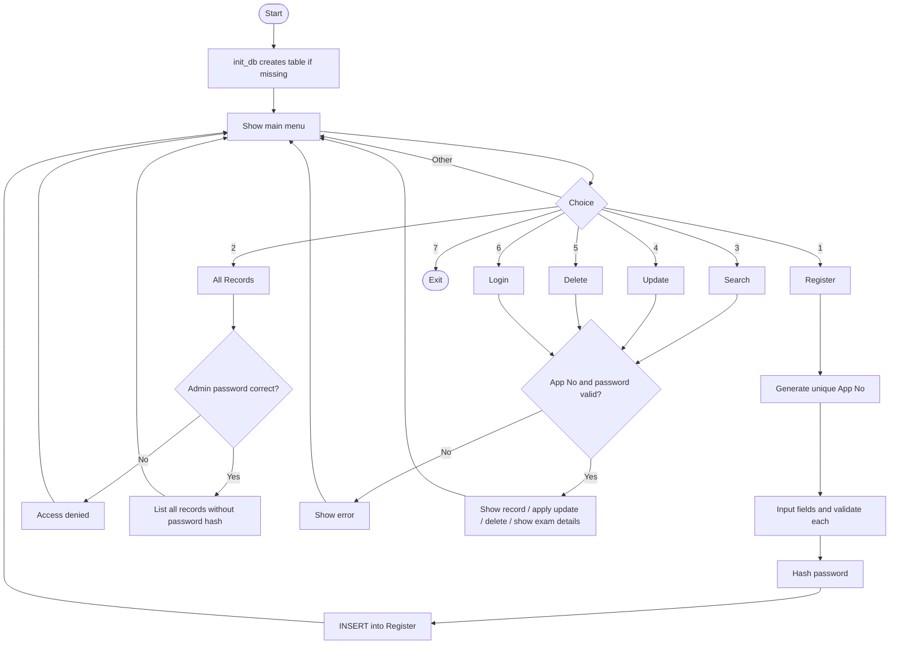
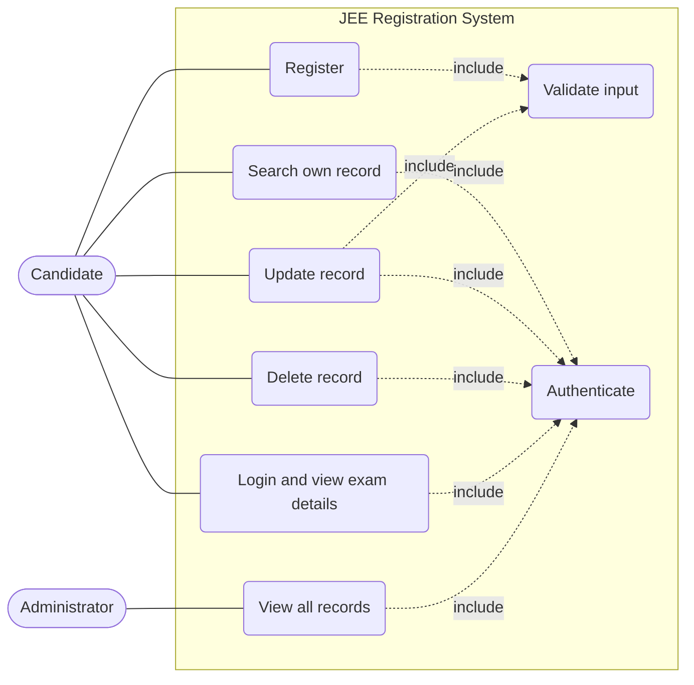
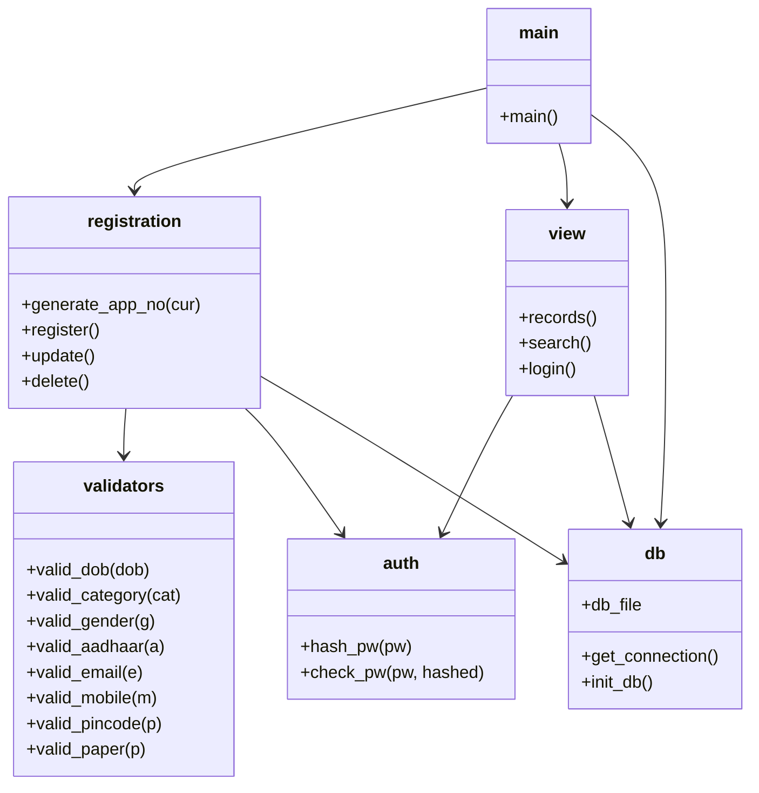
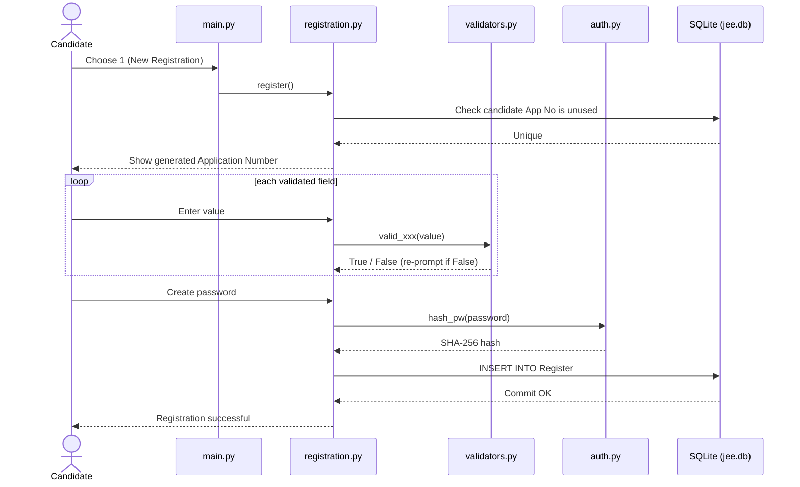
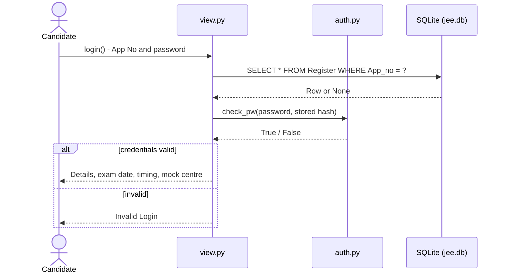
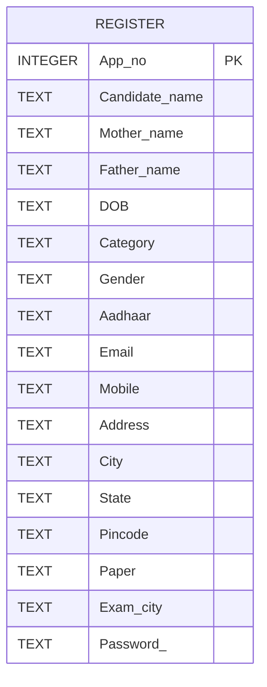

# JEE Exam Registration System — Project Statement

## 1. Problem Statement

Exam registration is usually done with paper forms or scattered spreadsheets, which leads to duplicate entries, invalid or incomplete data (wrong Aadhaar length, malformed dates, bad phone numbers), no reliable way for a candidate to look up or correct their own details, and weak protection of personal data such as passwords.

This project provides a simplified, command-line **JEE (Joint Entrance Examination) registration and management system**. Candidates register once, receive a computer-generated 8-digit Application Number, and can later use it with their password to view, update or delete their record and see their exam details. An administrator can list all registered candidates behind a separate admin password.

## 2. Objectives

1. Let a candidate register with validated personal, category and exam-preference details.
2. Generate a unique 8-digit Application Number automatically for every candidate.
3. Store passwords only as one-way hashes, never in plain text.
4. Let candidates securely view, search, update and delete only their own record.
5. Let an administrator view all records without ever exposing password hashes.
6. Persist data locally in SQLite with no external server or third-party packages.
7. Keep the code modular (one responsibility per file) and easy to test manually.

## 3. Scope of the Project

**In scope**

- Candidate registration with per-field validation (DOB, category, gender, Aadhaar, email, mobile, pincode, paper).
- Auto-generated unique Application Number.
- Password-protected search, update (any single field) and delete of a candidate record.
- Candidate login showing exam details (paper, city, fixed date/shift, reporting/closing time, mock exam centre).
- Admin-protected listing of all records.
- Local persistent storage using SQLite (`jee.db`).
- Terminal (CLI) interface only.

**Out of scope**

- Web or GUI front end, online payment, admit-card PDF generation, photo/signature upload.
- Real exam-centre allotment, real result or scoring processing.
- Multi-user concurrent access, network deployment, email/SMS verification.
- Verification of Aadhaar against any government service (only the 12-digit format is checked).

## 4. Target Users

| User | Description | Main needs |
|---|---|---|
| **Candidate** | A student applying for JEE (B.E / B.Tech / B.Arch / B.Planning) | Register, view exam details, correct mistakes, withdraw registration |
| **Administrator** | Person managing the registration data | Review all registered candidates |
| **Student / Developer / Evaluator** | Someone studying or grading the project | Understand a small modular Python + SQLite application |

## 5. High-Level Features

- **New Registration** — collects 16 fields, validates each, generates the Application Number, hashes the password.
- **All Records (admin)** — lists every candidate after an admin password check; password hashes are excluded.
- **Search Candidate** — Application Number + password returns that candidate's record.
- **Update Record** — after authentication, edit any one of 16 fields (validated where a rule exists); password can be changed too.
- **Delete Candidate** — permanently removes a record after credential check.
- **Login / View Exam Details** — shows the candidate's details plus exam date, shift, reporting/closing time and a mock centre.
- **Input validation** — reusable validator functions in one module.
- **Persistent storage** — SQLite database created automatically on first run.

## 6. Functional Requirements

| ID | Requirement |
|---|---|
| FR1 | The system shall create the `Register` table automatically at startup if it does not exist. |
| FR2 | The system shall generate a random 8-digit Application Number (10000000–99999999) that is not already in use. |
| FR3 | The system shall collect name, mother's name, father's name, DOB, category, gender, Aadhaar, email, mobile, address, city, state, pincode, paper, preferred exam city and password. |
| FR4 | The system shall validate DOB format (`YYYY-MM-DD`), category (GEN/OBC/SC/ST/EWS), gender (M/F/T), Aadhaar (12 digits), email (allowed domains), mobile (10 digits), pincode (6 digits) and paper (B.E/B.Tech/B.Arch/B.Planning), and re-prompt on invalid input. |
| FR5 | The system shall store only the SHA-256 hash of the password. |
| FR6 | The system shall show the Application Number and password to the candidate after successful registration. |
| FR7 | The system shall let a candidate search their record using Application Number and password. |
| FR8 | The system shall let an authenticated candidate update any single field of their record. |
| FR9 | The system shall let an authenticated candidate delete their record. |
| FR10 | The system shall let a candidate log in and view their exam details. |
| FR11 | The system shall require an admin password before listing all records and shall not display password hashes. |
| FR12 | The system shall reject non-numeric Application Numbers and invalid menu choices with a message and re-prompt. |

## 7. Non-Functional Requirements

| Category | Requirement |
|---|---|
| **Security** | Passwords stored as hashes; SQL uses `?` placeholders to prevent SQL injection; admin listing omits the password column. |
| **Usability** | Simple numbered menu; clear error messages; re-prompt on invalid input. |
| **Reliability** | Database connections are closed after every operation (including on failure); registration wrapped in try/except. |
| **Portability** | Pure Python 3.8+ standard library; runs on Windows, Linux, macOS. |
| **Maintainability** | Modular design (`db`, `auth`, `validators`, `registration`, `view`, `main`); validators reusable across register and update. |
| **Performance** | Instant response for small datasets; Application Number is the primary key (indexed). |
| **Data persistence** | Data survives restarts via the `jee.db` file located next to the scripts. |
| **Installability** | No third-party dependencies (see `requirements.txt`); database is git-ignored so each clone starts clean. |

## 8. System Architecture Diagram



## 9. Process / Workflow Diagram



## 10. UML Diagrams

### 10.1 Use Case Diagram



### 10.2 Class / Component Diagram

The code is procedural, so each module is shown as a component with its public functions.



### 10.3 Sequence Diagrams

**Registration**



**Login and view exam details**



## 11. Database / Storage Design

Storage is a single SQLite file, `jee.db`, created next to the scripts.

### 11.1 ER Diagram

The system has one entity. Each row represents one candidate; the Application Number is the primary key.



### 11.2 Schema Design

**Table: `Register`**

| # | Column | Type | Constraint | Description / validation rule |
|---|---|---|---|---|
| 1 | `App_no` | INTEGER | PRIMARY KEY | Auto-generated 8-digit Application Number |
| 2 | `Candidate_name` | TEXT | | Candidate's full name |
| 3 | `Mother_name` | TEXT | | Mother's name |
| 4 | `Father_name` | TEXT | | Father's name |
| 5 | `DOB` | TEXT | | Format `YYYY-MM-DD` |
| 6 | `Category` | TEXT | | One of GEN, OBC, SC, ST, EWS |
| 7 | `Gender` | TEXT | | One of M, F, T |
| 8 | `Aadhaar` | TEXT | | Exactly 12 digits (text to preserve leading zeros) |
| 9 | `Email` | TEXT | | Must belong to an allowed domain |
| 10 | `Mobile` | TEXT | | Exactly 10 digits |
| 11 | `Address` | TEXT | | Free text |
| 12 | `City` | TEXT | | Free text |
| 13 | `State` | TEXT | | Free text |
| 14 | `Pincode` | TEXT | | Exactly 6 digits |
| 15 | `Paper` | TEXT | | One of B.E, B.Tech, B.Arch, B.Planning (case-sensitive) |
| 16 | `Exam_city` | TEXT | | Preferred examination city |
| 17 | `Password_` | TEXT | | SHA-256 hex digest of the password |

```sql
CREATE TABLE IF NOT EXISTS Register (
    App_no         INTEGER PRIMARY KEY,
    Candidate_name TEXT,
    Mother_name    TEXT,
    Father_name    TEXT,
    DOB            TEXT,
    Category       TEXT,
    Gender         TEXT,
    Aadhaar        TEXT,
    Email          TEXT,
    Mobile         TEXT,
    Address        TEXT,
    City           TEXT,
    State          TEXT,
    Pincode        TEXT,
    Paper          TEXT,
    Exam_city      TEXT,
    Password_      TEXT
);
```

## 12. Known Limitations and Future Improvements

- **Password hashing:** SHA-256 without a salt is fast to brute-force; a salted, slow hash (bcrypt, scrypt or `hashlib.pbkdf2_hmac`) would be stronger.
- **Admin password:** it is hard-coded in `view.py` and documented in the README. Loading it from an environment variable or config file would be safer.
- **DOB check:** `strptime` checks the format and that the date exists, but does not enforce a sensible age range.
- **Email check:** the validator uses substring matching (`"@gmail.com" in e`), so a value like `x@gmail.com.evil.org` would pass; it also allows `@vitbhopal.ac.in` and `@proton.me`, which the error message does not mention.
- **Aadhaar and Application Number uniqueness:** two candidates could register with the same Aadhaar; a `UNIQUE` constraint would prevent that.
- **Update/delete consistency:** `delete()` compares hashes in SQL while other operations use `check_pw()`; unifying them would simplify maintenance.
- **Interface:** a web or GUI front end, admit-card generation and automated tests (e.g. `unittest` for validators) are natural next steps.
